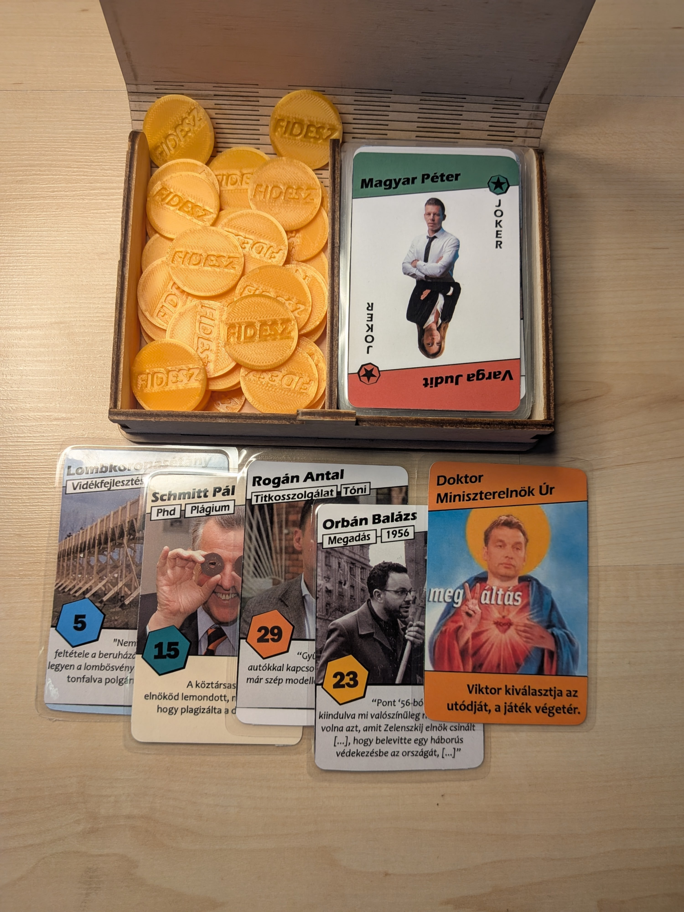

# STRÓMANÓ társasjáték

 > Oszd meg és terjeszd az egész országban! Korlátlanul terjeszthető.

 ## Mi az a STRÓMANÓ?

 

 Egy vicces, könnyen tanulható társasjáték, ami még a kormányt is kritizálja. Mi kell még? A Thorsten Gimmler által tervezett "Nincs Kegyelem" játék alapján készült. 

 ## Elkészítés

 A játékhoz ki kell nyomtatni és kivágni a lapokat, valamint érméket kell szerezni. Érdemes vastag papírra nyomtatni, a lapok sarkait lekerekíteni, és laminálni őket a tartósság érdekében. Érdemes lehet fénymásoló boltban (pl.: Copyguru) kinyomtatni őket.

 Korongnak használhatóak gombok, 5 forintosok, csavaranyák. Egy rendes műanyag zseton kb. 30-50 forint, egy póker zseton még több.

 Egy készlet tartalma:
  * Számozott lapok 2-35
  * Különleges lapok
    * Doktor Miniszterelnök Úr
    * 2 körfördító
    * 9 különleges lap (DLC)
  * 56 játékérme
  * Szabályzat
